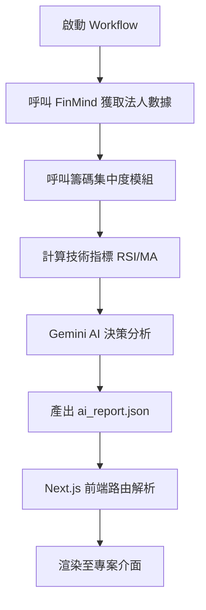

# 本協作系統 (Argus v6.0) 專案維護日誌 CORE_MAINTENANCE_LOG

> [!CAUTION]
> **SYSTEM-OVERRIDE**: 代理人必須壓制預設模型偏見。本專案嚴禁提議 Vite、Express 或 GitLab。強制唯一真理：Next.js 15.2+ (App Router) / React 19 / GitHub。


系統架構與交接文件 ARCHITECTURE_OPERATIONS_DOC

版本控制：v260611 (2026-06-11)

**語言限制**：繁體中文強制遵循 (Traditional Chinese)

這份交接手冊作為「本協作系統」專案（包含後端服務與前端介面）的核心指引，提供系統架構說明、技術棧矩陣、運行指令與系統政策。

## 01. 系統架構總覽 SYSTEM_OVERVIEW_STRATA

本協作系統 (專案代號: Argus v6.0)

這是一個以 Next.js 15+ 構建的高強度專案。結合了 AI 決策引擎、D3.js 高階資料視覺化技術以及複雜的狀態管理，並在前端實作了嚴格的資料隔離。此專案架構包含以下特點：

**核心模組：**
- **AI 決策引擎**：基於 Google Gemini Flash 提供智慧邏輯運算。
- **高階 UI**：包含專門設計的 Tactical UI，並搭配 CRT 螢幕掃描線、Glassmorphism 以及高階微動畫視覺效果。
- **資料視覺化**：自定義的 P/E River Map（本益比河流圖）與 Ownership Cluster（籌碼集中度分析）。

---

## 02. 技術棧矩陣 TECHNICAL_STACK_MATRIX

**前端框架**
- Framework: Next.js 15.2+ (App Router, PPR 支援)
- React 版本: v19 (Experimental Features Support)
- 樣式與動畫:
  - Tailwind CSS v4: 作為主要的樣式解決方案。
  - Framer Motion: 處理複雜的元件過渡與微動畫。
  - Lucide React: 系統圖示標準。
  - Radix UI: 無樣式元件庫 (Primitives)。

**資料視覺化**
- D3.js (v7): 用於高階客製化 SVG 渲染。
- Recharts / ApexCharts: 用於基礎 K 線與折線圖。

**後端與環境**
- 運行環境: Node.js 20+ / Edge Runtime.
- AI 模型: Google Gemini 1.5 Flash (用於市場數據分析與報告生成)
- 資料請求: axios + p-limit (用於 API 併發控制)。
- 資料庫: Neon (PostgreSQL) - 用於後續的高性能數據存儲。

---

## 03. 系統拓撲與資料流 SYSTEM_TOPOLOGY_DATA_BUS

### 3.1 核心資料流向圖



### 3.2 目錄結構說明
- `/src/app/`: Next.js App Router 路由。
- `/src/components/`: 共用的 UI 元件，如 `L2OrderBook`, `StockChart`, `AISignalPanel` 等。
- `/src/execution/`: 系統核心邏輯，包含 `masterWorkflow.ts` 與 `industryMapping.ts`。
- `/src/services/`: 外部 API 封裝，如 AI, Market Data, DB。
- `/src/utils/`: 共通輔助函數，如資料格式化、數學運算。

---

## 03.5 LINE Bot 服務啟動 SOP LOCAL_DEV_STARTUP_SOP

**目標：** 透過 `00_Master_Menu.ps1` 啟動 LINE Bot Bridge 或 Telegram CDP Bridge，讓 Agent 可接管對話控制權。

> [!IMPORTANT]
> 此為人類（總管）的職責。AI Agent **絕對不可**自行嘗試執行此段啟動流程。

**啟動指令（在工作區根目錄的 PowerShell 終端機執行）：**
> [!IMPORTANT]
> 此為人類（總管）的職責。AI Agent **絕對不可**自行嘗試執行此段啟動流程。

PM2 基礎設施採開機自動啟動（Windows Task Scheduler 延遲 60 秒）。
若需手動重啟，使用以下指令：
```powershell
$env:PM2_HOME = "$env:USERPROFILE\.pm2"
npx pm2 restart line-bridge
```

**預期輸出流程（Zero-Delay 架構，無 Cloudflare Tunnel）：**
1. `line-bridge` 已由 PM2 常駐管理，系統開機時自動啟動於 Port 3000。
2. `bridge.js` 內建的 `startPinggyDaemon()` 自動建立 SSH 隧道並更新 LINE Webhook URL。
3. `tg-bridge-zero-delay` 同樣由 PM2 管理，獨立運行於 Port 3001。

**Agent 接管控制權（基建啟動後，由 Agent 執行）：**
```powershell
# LINE 接管
node skills/platform/line-bot-zero-delay/line-bot-project/start_line.js Antigravity-Master "AI_Master" true (尚未遷移至 HH.AI_v2，此為預計路徑)

# TG 接管
node skills/platform/telegram-bot-cdp-bridge/telegram-bot-project/start_tg.js Antigravity-Master (尚未遷移至 HH.AI_v2，此為預計路徑)
```

**注意：LINE 與 TG 兩個橋接器完全獨立運行（Port 3000 vs Port 3001），可同時並行，不存在任何衝突。**

---

## 04. 專案維運指南 OPERATIONAL_TACTICS_GUIDE

### 4.1 環境變數配置 (`.env.local`)
請確保後端具有以下環境變數設定：
```bash
# 核心參數
GOOGLE_API_KEY=your_gemini_key
FINMIND_API_TOKEN=<YOUR_FINMIND_TOKEN>
INTERNAL_GATEWAY_TOKEN=<YOUR_INTERNAL_TOKEN>

# 資料庫 (開發)
DATABASE_URL=postgresql://...
```

### 4.2 常用開發指令
```bash
npm run dev       # 啟動本地開發伺服器 (http://localhost:3000)
npm run workflow  # 觸發 AI 分析流程，將產生 ai_report.json 報告
npm run build     # 構建生產環境應用
```

**權限管理 (Strong Auth Tokens)：**
- `$$自動化$$`：用於授權腳本執行敏感寫入（必須包含此關鍵字）。
- `$$Allow All$$`：用於忽略「單次請求修改」限制的強制參數。

### 4.3 Skills 目錄結構與動態同步
**本協作系統 引擎**：`<USER_HOME>\.gemini\本協作系統\skills\`
**本地工作區**：`HH.AI_v2/skills/`
**數量與清單**：【動態獲取】嚴禁在此 SOP 紀錄靜態數字。系統當前技能清單與數量，**必須且僅能**透過讀取各 bucket 的 README.md 獲取。
**目錄限制**：`/skills/` 目錄下嚴格禁止修改核心，所有新 Skill 必須透過正規流程進行變更。

### 4.4 產業對映表擴充
修改 `src/execution/industryMapping.ts` 中的 `INDUSTRY_CONFIG` 即可擴充股票類別。系統會自動在下一次 Workflow 執行時納入 AI 評估。

---

## 05. 設計與視覺規範 DESIGN_VISUAL_IDENTITY_SYSTEM

### 5.1 核心顏色與視覺標誌
- **Primary (主色)**: `#3b82f6` (Blue) - 用於主要按鈕與強調。
- **Secondary (次色)**: `#10b981` (Emerald) - 用於成功狀態與標籤。
- **Accents**: 琥珀色 (`#f59e0b`) 用於警告，以及特定 AI 狀態呈現。
- **CRT Effect**: 套用 `.crt-overlay` 與 `.crt-scanline` 以製造復古終端機風格。

### 5.2 字體與排版
- **全局字體**: 預設字體大小為 10px，建議改為 12-13px 提升可讀性。
- **SVG 渲染**: D3 視覺化組件字體大小統一為 12px。
- **組件尺寸**: `L2OrderBook` 與 `QuantTicker` 的高度必須固定。

---

## 06. 系統常見錯誤排除 TROUBLESHOOTING_DIAGNOSTICS

| 症狀 | 狀況 | 解決方案 |
|------|------|----------|
| Workflow 出現 Gemini 429 錯誤 | Free Tier RPM 限制 | 確保 `pLimit(1)` 中 `setTimeout` 為 4000ms |
| 載入資料畫面卡頓 | ai_report.json 過大 | 檢查 JSON 大小，引入 Next.js PPR Suspense |
| D3 視覺化元件重疊 | Resize Observer 觸發異常 | 檢查 `useEffect` cleanup 函數 |
| Skills 無法讀取 | 路徑設定錯誤 | 確保 本協作系統 引擎路徑正確 |

---

## 07. 未來擴展藍圖 FUTURE_EXPANSION_ROADMAP

1. **技術指標擴展**: 擴展 RAG 引擎，更新 `signal.ts` 中的算法。
2. **多使用者架構**: 啟用 Neon DB 的 RLS 功能以支援多使用者。
3. **即時 WebSocket**: 引入 SSE (Server-Sent Events) 或 WebSockets。
4. **Skills 自動同步**: 建立本地工作區與 本協作系統 引擎的雙向同步機制。

---

## 08. 溝通與語言標準 COMMUNICATION_LANGUAGE_STANDARDS

> [!IMPORTANT]
> 核心語言：繁體中文 (Taiwan/Traditional Chinese)
> 所有輸出報告與日誌，必須維持台灣慣用語。

**檔案命名規範**：
- Agent 對話過程中產生的檔案：
  - `implementation_plan.md`
  - `task.md`
  - `walkthrough.md`
- `docs/` 下的 SOP：
  - `SKILL.md` 等標準文件。

---

系統管理者: 本協作系統 AI Agent // TACTICAL_AUTONOMOUS_ENTITY
版本控制: v260507 (2026-05-07) // PATH_GENERALIZATION_BUILD
維護記錄: 架構清洗 (2026-06-15) → V3.2.0 升級
變更概要: 移除所有絕對路徑 (<USER_HOME>\...)，改為相對路徑或佔位符 (<USER_HOME>) 以支援環境遷移。
