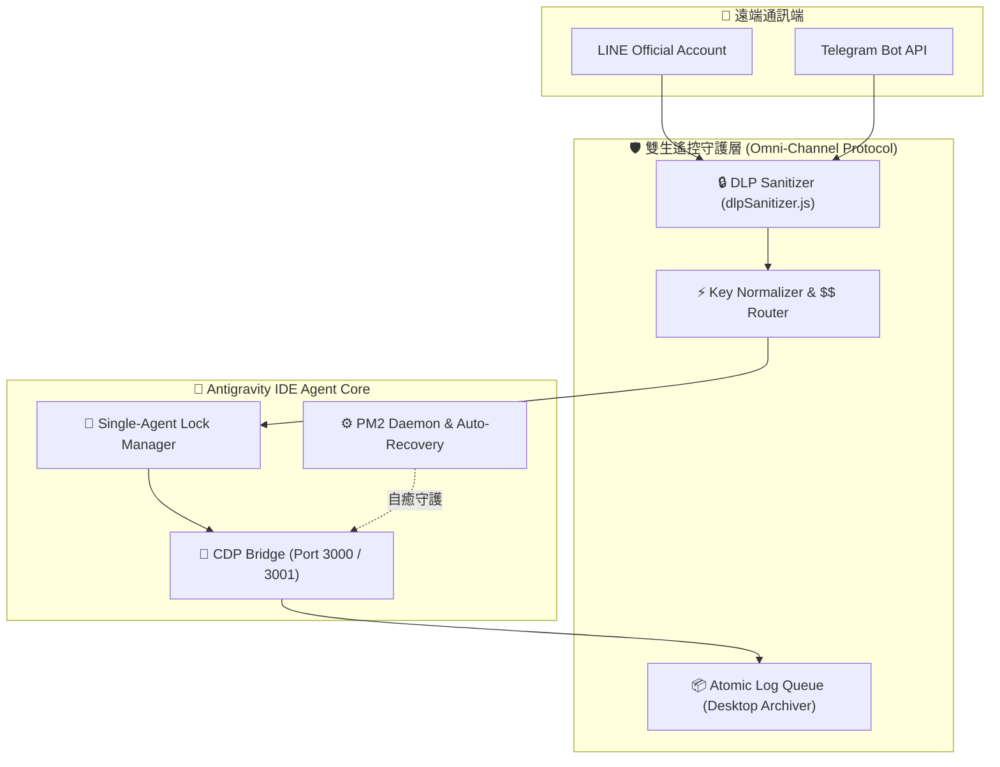

# ADR-0011: Omni-Channel 雙生遙控通訊架構與 Task-Exit Loop 演進

- Status: Accepted
- Date: 2026-08-24

## Context

為實現自動化工作站的遠端操控，通訊模組（LINE 與 Telegram）歷經了多個版本的演進，從傳統的定時輪詢，逐步升級為毫秒級無延遲且自我復原的常駐守護架構。

**Telegram 連線架構演進歷程**：
- **v0.1.0**：採用 grammy 框架進行 Long-Polling，實現 Telegram Forum Topics 對應專案結構，以及基礎的 SQLite 狀態持久化。
- **v0.2.0**：由單純擷取文字升級為 DOM 結構化抽取，並加入動態 Emoji 回饋以配合 Agent 的 Planning Mode 推播決策。
- **v0.2.14**：增強併發防護（Workspace Prompt Locking）與安全過濾，修復 HTML 實體轉義問題與 tool-call 輸出洩漏。

**LINE 連線架構演進歷程**：
- **V1 (傳統 polling)**：使用定時輪詢檢查資料庫，存在高延遲與資源浪費問題。
- **V2 (File Event + 穿透隧道)**：改用 `fs.watch` 檔案事件驅動，並透過 Cloudflare Tunnel 穿透 NAT，將延遲縮短至毫秒級。
- **V3 (PM2 + Pinggy 隧道守護)**：廢除手動啟動隧道，改由 PM2 背景守護 `bridge.js` 及其內建的 Pinggy SSH 隧道，並支援自動更新 Webhook。
- **V4 (Task-Exit Loop 與雙生協定)**：導入 Task-Exit Loop 機制，並將 LINE 與 TG 的底層安全、歸檔與守護邏輯統一為「雙生遙控通訊架構 (Omni-Channel Guardian Protocol)」。

## Decision

正式確立採用 **V4 Omni-Channel Guardian Protocol** 作為 `line-bot-zero-delay` 與 `telegram-bot-cdp-bridge` 的共享底層架構。該架構模型如下：

此架構由以下三大支柱構成：

1. **資安與對話歸檔規範 (DLP & Archive)**：
   雙平台外發訊息強制通過統一的 DLP 淨化模組（舊專案位於 `Modules/shared/dlpSanitizer.js`，尚未遷移至 HH.AI_v2；該模組的註解明確記載『同時服務 LINE Bot (CommonJS) 與 Telegram Bot (TypeScript)』，是目前系統中已實際運作的共用模組範例），防止 API 金鑰外洩；對話記錄以非同步 Atomic Queue 進行本機歸檔。
2. **特權語彙 ($$ Triggers) 精準路由**：
   統整所有 `$$` 特權指令的字元正規化（全半形轉換、空白消除、轉小寫）。特定指令如 `$$LINE連線$$` 觸發單一 Agent 強制鎖定，而 `$$Line帳號$$` 則觸發 `bot-account-switcher` 技能。
3. **Task-Exit Loop (零延遲喚醒機制)**：
   當背景監聽器（如 `poll_inbox.js` 或 `poll_tg.js`）接獲新訊息時，會寫入 stdout 並執行 `process.exit(0)`，觸發 IDE 任務結束事件以強制喚醒 Agent。
   *(參照 **ADR-0009**：此處的無限輪詢迴圈不僅是為了接收訊息，其常駐特性正是維持 Windows Job Object 存活的關鍵，絕對不能被「優化」掉)*

## Consequences

- **管線職責分離**：此架構鞏固了雙平台作為 I/O 守護層的角色，與內部的 Loki Swarm 自動化管線（參照 **ADR-0008**）明確分離，確保前端通訊與後端金融邏輯不互相干擾。
- **路徑與參數約束**：受限於 PowerShell 參數傳遞陷阱（參照 **ADR-0010**），所有與此通訊架構互動的腳本呼叫，都必須嚴格使用絕對路徑與「寫檔再讀檔」模式，以確保進程不會因找不到檔案而卡死在 stdin 等待中。
- **架構約束**：未來的任何重構都必須保持「Task-Exit Loop」與「單一 Task 串接啟動（ADR-0009）」的相依性，不得將啟動腳本與輪詢監聽拆分為多個獨立的 Task。
